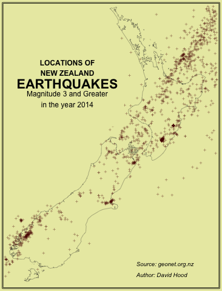
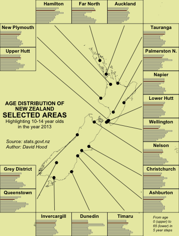
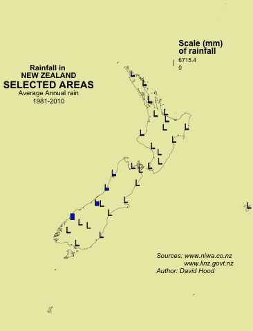

# statAtlasNZ
A Statistical Atlas of New Zealand (in R)

This is intended as a demonstration of the saved steps (and finished figures) for producing various maps from public data for New Zealand. Feel free to fork the project and contribute your own examples. The rules, such as they are:

* It is MIT licenced to preserve authorship, which means people can use the map and the code as they see fit, but should acknowledge you. Add you name to the general authors.md file if you like, should you contribute
* Put each map in a different subfolder, so that each is self contained, and add the details to the list below
* Include a source for the data, I would say an excellent plan is a construction along the lines of 

```
if(!(file.exists("local.cache"))){
download.file(url=remote.copy, destfile="local.cache")
}
```

## Maps included:

### Earthquakes of 2014

Geonet data for 2014 plotted using maps and points.



### Age distributions of Regions

Statistics New Zealand Data done as a "figure within figure graph".



### Average Rainfall

this involved merging the NIWA rain data with the LINZ location data

